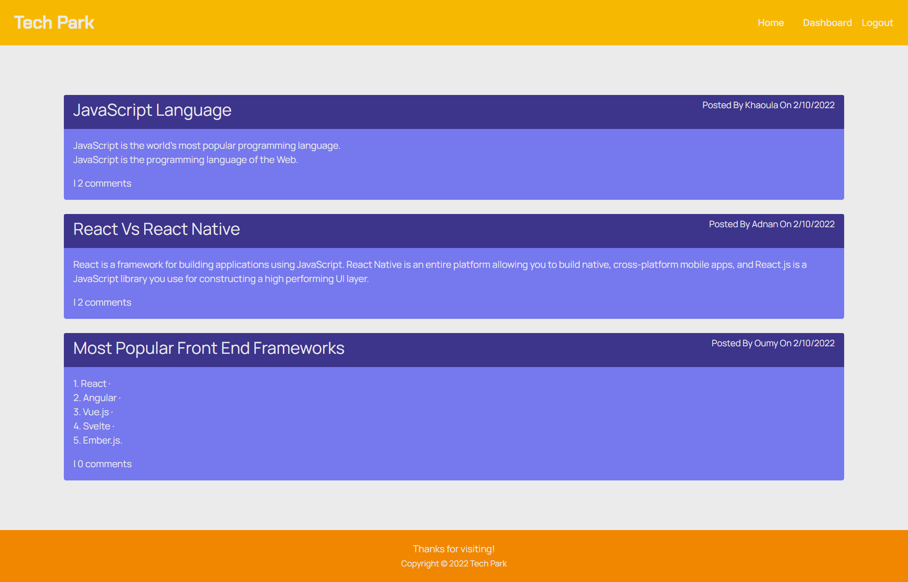

# TechPark

## Description

- Tech Park is CMS-style blog site similar to a Wordpress site, where developers can publish their blog posts and comment on other developers’ posts as well.  

## User 

- AS A developer who writes about tech I WANT a CMS-style blog site so that I can publish articles, blog posts, and my thoughts and opinions
 

## Screenshot 

 

## Technologies 

- Express.js
- Node.js
- MySQL
- Sequelize ORM
- JavaScript
- Bcrypt
- Bootstrap
- Handlebars
 

## Links

Live Site - https://tech-park-99.herokuapp.com/
 

## Contributions

Tech Park created by Khaoula Jabour